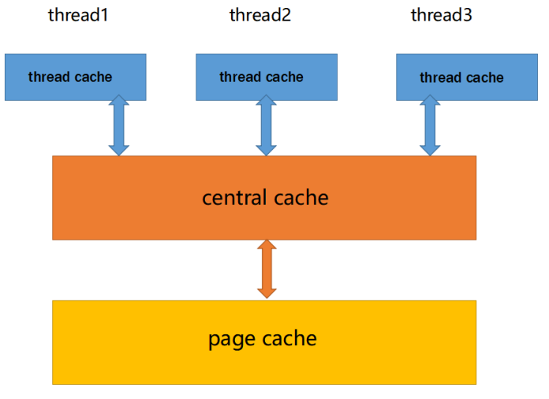

#HighConcurrentMemoryPool

内存池(Memory Pool) 是一种动态内存分配与管理技术。 通常情况下，程序员习惯直接使 用 new、delete、malloc、free 等API申请分配和释放内存，这样导致的后果是：当程序长时间 运行时，由于所申请内存块的大小不定，频繁使用时会造成大量的内存碎片从而降低程序和操作 系统的性能。内存池则是在真正使用内存之前，先申请分配一大块内存(内存池)留作备用，当程序 员申请内存时，从池中取出一块动态分配，当程序员释放内存时，将释放的内存再放入池内，再 次申请池可以 再取出来使用，并尽量与周边的空闲内存块合并。若内存池不够时，则自动扩大内 存池，从操作系统中申请更大的内存池。

## 特点

现代很多的开发环境都是多核多线程，在申请内存的场景下，必然存在激烈的锁竞争问题。所以 这次我们实现的内存池需要考虑以下几方面的问题。 

1. 内存碎片问题。 
2.  性能问题。 
3.  多核多线程环境下，锁竞争问题。

## 框架

concurrent memory pool主要由以下3个部分构成： 

1. thread cache：线程缓存是每个线程独有的，用于小于64k的内存的分配，线程从这里申请 内存不需要加锁，每个线程独享一个cache，这也就是这个并发线程池高效的地方。 
2.  central cache：中心缓存是所有线程所共享，thread cache是按需从central cache中获 取的对象。central cache周期性的回收thread cache中的对象，避免一个线程占用了太多的 内存，而其他线程的内存吃紧。达到内存分配在多个线程中更均衡的按需调度的目的。 central cache是存在竞争的，所以从这里取内存对象是需要加锁，不过一般情况下在这里取 内存对象的效率非常高，所以这里竞争不会很激烈。 
3. page cache：页缓存是在central cache缓存上面的一层缓存，存储的内存是以页为单位存 储及分配的，central cache没有内存对象时，从page cache分配出一定数量的page，并切 割成定长大小的小块内存，分配给central cache。page cache会回收central cache满足条 件的span对象，并且合并相邻的页，组成更大的页，缓解内存碎片的问题。

